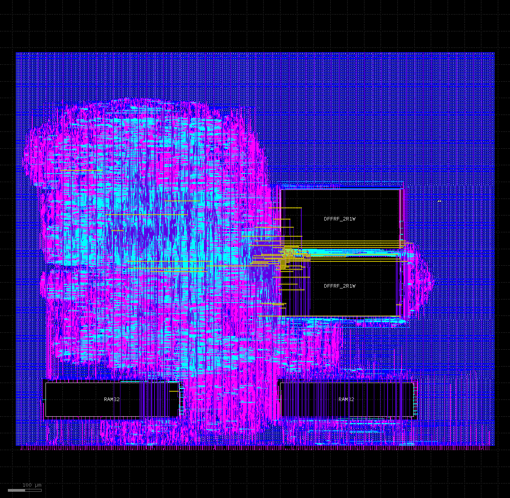

# A2P MPW

## OpenLane

   * core-only, flat, DFFRAM, 128/128, 66MHz, 1450x1200,

   

## UPRJ Simulation

* simple a2nc + one core, in uprj wrapper

   * mprj and uprj can master to a2nc regs
   * uprj can 'master' to mprj using riscv programmed as memory controller (a2nc-generated irqs for reads/writes)


```
make run

rm -f results.xml
make -f Makefile results.xml
make[1]: Entering directory '/data/projects/a2p-openpowerwtf/rtl/a2node_mpw/sim/coco'
rm -f results.xml
MODULE=tb TESTCASE=tb_boot TOPLEVEL=top_1w TOPLEVEL_LANG=verilog \
         /usr/local/bin/vvp -M /home/wtf/.local/lib/python3.10/site-packages/cocotb/libs -m libcocotbvpi_icarus   build_a2nc/sim.vvp
     -.--ns INFO     gpi                                ..mbed/gpi_embed.cpp:76   in set_program_name_in_venv        Did not detect Python virtual environment. Using system-wide Python interpreter
     -.--ns INFO     gpi                                ../gpi/GpiCommon.cpp:101  in gpi_print_registered_impl       VPI registered
     0.00ns INFO     cocotb                             Running on Icarus Verilog version 12.0 (devel)
     0.00ns INFO     cocotb                             Running tests with cocotb v1.7.1 from /home/wtf/.local/lib/python3.10/site-packages/cocotb
     0.00ns INFO     cocotb                             Seeding Python random module with 1676673053
     0.00ns INFO     cocotb.regression                  Found test tb.tb_boot
     0.00ns INFO     cocotb.regression                  running tb_boot (1/1)
                                                          A Vulgar Display of OpenPower

                                                          uprj boot -> mprj
     0.00ns INFO     cocotb.top_1w                      [00000000] Set threads=1.
     9.00ns INFO     cocotb.top_1w                      [00000000] Parsed 500 tests from ./fx_alucmp_10x500_2022_1204_1450.tst.
     9.00ns INFO     cocotb.top_1w                      [00000000] WB Driver [RISCV]: Started.
     9.00ns INFO     cocotb.top_1w                      [00000000] MPRJ Monitor [RISCV]: Started.
     9.00ns INFO     cocotb.top_1w                      [00000000] A2P Driver: started.
     9.00ns INFO     cocotb.top_1w                      [00000000] A2P Checker: started.
     9.00ns INFO     cocotb.top_1w                      [00000000] A2P Monitor: started.
    12.00ns INFO     cocotb.top_1w                      [00000000] Manually reset system and CFG[0] core reset.
    12.00ns INFO     cocotb.top_1w                      [00000000] MPRJ Monitor [RISCV]: SKIPPING C0 CFG reset - manual tst.
    12.00ns INFO     cocotb.top_1w                      [00000000] * 32b XER adjust: 6A700078->60000078
    12.00ns INFO     cocotb.top_1w                      [00000000] Skipping: 0003A4840BD5CAA0
    12.00ns INFO     cocotb.top_1w                      [00000000] Skipping: 0003A4840BD5CAA8
    12.00ns INFO     cocotb.top_1w                      [00000000] Skipping: 0003F3BE81800010
    12.00ns INFO     cocotb.top_1w                      [00000000] Skipping: 00F2D2894CCCB268
    12.00ns INFO     cocotb.top_1w                      [00000000] Loaded tst 1329: Starting IAR:00010000 Ending IAR:00010028
    12.00ns INFO     cocotb.top_1w                      [00000000] ...tick...
    26.00ns INFO     cocotb.top_1w                      [00000014] MPRJ Monitor [RISCV]: IRQ status changed: 0 -> 1
    28.00ns INFO     cocotb.top_1w                      [00000016] MPRJ Monitor [RISCV]: Begin processing IRQ for uprj read...
    29.00ns INFO     cocotb.top_1w                      [00000017] MPRJ Monitor [RISCV]: Reading MADR...
    34.00ns INFO     cocotb.top_1w                      [00000022] MPRJ Monitor [RISCV]: MADR=00000000
    35.00ns INFO     cocotb.top_1w                      [00000023] MPRJ Monitor [RISCV]: Writing MDAT=00000000...
    40.00ns INFO     cocotb.top_1w                      [00000028] MPRJ Monitor [RISCV]: Resetting MCMD[0]...
    44.00ns INFO     cocotb.top_1w                      [00000032] MPRJ Monitor [RISCV]: IRQ status changed: 1 -> 0
    45.00ns INFO     cocotb.top_1w                      [00000033] MPRJ Monitor [RISCV]: <<< uprj rd: @00000000=4C000064 >>>
    51.00ns INFO     cocotb.top_1w                      [00000039] MPRJ Monitor [RISCV]: IRQ status changed: 0 -> 1
    53.00ns INFO     cocotb.top_1w                      [00000041] MPRJ Monitor [RISCV]: Begin processing IRQ for uprj read...
    54.00ns INFO     cocotb.top_1w                      [00000042] MPRJ Monitor [RISCV]: Reading MADR...
    59.00ns INFO     cocotb.top_1w                      [00000047] MPRJ Monitor [RISCV]: MADR=00000004
    60.00ns INFO     cocotb.top_1w                      [00000048] MPRJ Monitor [RISCV]: Writing MDAT=00000004...
    65.00ns INFO     cocotb.top_1w                      [00000053] MPRJ Monitor [RISCV]: Resetting MCMD[0]...
    69.00ns INFO     cocotb.top_1w                      [00000057] MPRJ Monitor [RISCV]: IRQ status changed: 1 -> 0
    70.00ns INFO     cocotb.top_1w                      [00000058] MPRJ Monitor [RISCV]: <<< uprj rd: @00000004=48000000 >>>
    76.00ns INFO     cocotb.top_1w                      [00000064] MPRJ Monitor [RISCV]: IRQ status changed: 0 -> 1
    78.00ns INFO     cocotb.top_1w                      [00000066] MPRJ Monitor [RISCV]: Begin processing IRQ for uprj read...
    79.00ns INFO     cocotb.top_1w                      [00000067] MPRJ Monitor [RISCV]: Reading MADR...
    84.00ns INFO     cocotb.top_1w                      [00000072] MPRJ Monitor [RISCV]: MADR=00000008
    85.00ns INFO     cocotb.top_1w                      [00000073] MPRJ Monitor [RISCV]: Writing MDAT=00000008...
    90.00ns INFO     cocotb.top_1w                      [00000078] MPRJ Monitor [RISCV]: Resetting MCMD[0]...
    94.00ns INFO     cocotb.top_1w                      [00000082] MPRJ Monitor [RISCV]: IRQ status changed: 1 -> 0
    95.00ns INFO     cocotb.top_1w                      [00000083] MPRJ Monitor [RISCV]: <<< uprj rd: @00000008=00000000 >>>
   101.00ns INFO     cocotb.top_1w                      [00000089] MPRJ Monitor [RISCV]: IRQ status changed: 0 -> 1
   103.00ns INFO     cocotb.top_1w                      [00000091] MPRJ Monitor [RISCV]: Begin processing IRQ for uprj read...
   104.00ns INFO     cocotb.top_1w                      [00000092] MPRJ Monitor [RISCV]: Reading MADR...
   109.00ns INFO     cocotb.top_1w                      [00000097] MPRJ Monitor [RISCV]: MADR=0000000C
   110.00ns INFO     cocotb.top_1w                      [00000098] MPRJ Monitor [RISCV]: Writing MDAT=0000000C...
   111.00ns INFO     cocotb.top_1w                      [00000100] ...tick...
   115.00ns INFO     cocotb.top_1w                      [00000103] MPRJ Monitor [RISCV]: Resetting MCMD[0]...
   119.00ns INFO     cocotb.top_1w                      [00000107] MPRJ Monitor [RISCV]: IRQ status changed: 1 -> 0
   120.00ns INFO     cocotb.top_1w                      [00000108] MPRJ Monitor [RISCV]: <<< uprj rd: @0000000C=00000000 >>>
   126.00ns INFO     cocotb.top_1w                      [00000114] MPRJ Monitor [RISCV]: IRQ status changed: 0 -> 1
   128.00ns INFO     cocotb.top_1w                      [00000116] MPRJ Monitor [RISCV]: Begin processing IRQ for uprj read...
   129.00ns INFO     cocotb.top_1w                      [00000117] MPRJ Monitor [RISCV]: Reading MADR...
   134.00ns INFO     cocotb.top_1w                      [00000122] MPRJ Monitor [RISCV]: MADR=00000010
   135.00ns INFO     cocotb.top_1w                      [00000123] MPRJ Monitor [RISCV]: Writing MDAT=00000010...
   140.00ns INFO     cocotb.top_1w                      [00000128] MPRJ Monitor [RISCV]: Resetting MCMD[0]...
   144.00ns INFO     cocotb.top_1w                      [00000132] MPRJ Monitor [RISCV]: IRQ status changed: 1 -> 0
   145.00ns INFO     cocotb.top_1w                      [00000133] MPRJ Monitor [RISCV]: <<< uprj rd: @00000010=00000000 >>>
   151.00ns INFO     cocotb.top_1w                      [00000139] MPRJ Monitor [RISCV]: IRQ status changed: 0 -> 1
   153.00ns INFO     cocotb.top_1w                      [00000141] MPRJ Monitor [RISCV]: Begin processing IRQ for uprj read...
   154.00ns INFO     cocotb.top_1w                      [00000142] MPRJ Monitor [RISCV]: Reading MADR...
   159.00ns INFO     cocotb.top_1w                      [00000147] MPRJ Monitor [RISCV]: MADR=00000014
   160.00ns INFO     cocotb.top_1w                      [00000148] MPRJ Monitor [RISCV]: Writing MDAT=00000014...
   165.00ns INFO     cocotb.top_1w                      [00000153] MPRJ Monitor [RISCV]: Resetting MCMD[0]...
   169.00ns INFO     cocotb.top_1w                      [00000157] MPRJ Monitor [RISCV]: IRQ status changed: 1 -> 0
   170.00ns INFO     cocotb.top_1w                      [00000158] MPRJ Monitor [RISCV]: <<< uprj rd: @00000014=00000000 >>>
   176.00ns INFO     cocotb.top_1w                      [00000164] MPRJ Monitor [RISCV]: IRQ status changed: 0 -> 1
   178.00ns INFO     cocotb.top_1w                      [00000166] MPRJ Monitor [RISCV]: Begin processing IRQ for uprj read...
   179.00ns INFO     cocotb.top_1w                      [00000167] MPRJ Monitor [RISCV]: Reading MADR...
   184.00ns INFO     cocotb.top_1w                      [00000172] MPRJ Monitor [RISCV]: MADR=00000018
   185.00ns INFO     cocotb.top_1w                      [00000173] MPRJ Monitor [RISCV]: Writing MDAT=00000018...
   190.00ns INFO     cocotb.top_1w                      [00000178] MPRJ Monitor [RISCV]: Resetting MCMD[0]...
   194.00ns INFO     cocotb.top_1w                      [00000182] MPRJ Monitor [RISCV]: IRQ status changed: 1 -> 0
   195.00ns INFO     cocotb.top_1w                      [00000183] MPRJ Monitor [RISCV]: <<< uprj rd: @00000018=00000000 >>>
   201.00ns INFO     cocotb.top_1w                      [00000189] MPRJ Monitor [RISCV]: IRQ status changed: 0 -> 1
   203.00ns INFO     cocotb.top_1w                      [00000191] MPRJ Monitor [RISCV]: Begin processing IRQ for uprj read...
   204.00ns INFO     cocotb.top_1w                      [00000192] MPRJ Monitor [RISCV]: Reading MADR...
   209.00ns INFO     cocotb.top_1w                      [00000197] MPRJ Monitor [RISCV]: MADR=0000001C
   210.00ns INFO     cocotb.top_1w                      [00000198] MPRJ Monitor [RISCV]: Writing MDAT=0000001C...
   211.00ns INFO     cocotb.top_1w                      [00000200] ...tick...
   215.00ns INFO     cocotb.top_1w                      [00000203] MPRJ Monitor [RISCV]: Resetting MCMD[0]...
   219.00ns INFO     cocotb.top_1w                      [00000207] MPRJ Monitor [RISCV]: IRQ status changed: 1 -> 0
   220.00ns INFO     cocotb.top_1w                      [00000208] MPRJ Monitor [RISCV]: <<< uprj rd: @0000001C=00000000 >>>
   227.00ns INFO     cocotb.top_1w                      [00000215] A2P: CP 00000000
   236.00ns INFO     cocotb.top_1w                      [00000224] MPRJ Monitor [RISCV]: IRQ status changed: 0 -> 1
   238.00ns INFO     cocotb.top_1w                      [00000226] MPRJ Monitor [RISCV]: Begin processing IRQ for uprj read...
   239.00ns INFO     cocotb.top_1w                      [00000227] MPRJ Monitor [RISCV]: Reading MADR...
   244.00ns INFO     cocotb.top_1w                      [00000232] MPRJ Monitor [RISCV]: MADR=00010000
   245.00ns INFO     cocotb.top_1w                      [00000233] MPRJ Monitor [RISCV]: Writing MDAT=00010000...
   250.00ns INFO     cocotb.top_1w                      [00000238] MPRJ Monitor [RISCV]: Resetting MCMD[0]...
   254.00ns INFO     cocotb.top_1w                      [00000242] MPRJ Monitor [RISCV]: IRQ status changed: 1 -> 0
   255.00ns INFO     cocotb.top_1w                      [00000243] MPRJ Monitor [RISCV]: <<< uprj rd: @00010000=28148160 >>>
   261.00ns INFO     cocotb.top_1w                      [00000249] MPRJ Monitor [RISCV]: IRQ status changed: 0 -> 1
   263.00ns INFO     cocotb.top_1w                      [00000251] MPRJ Monitor [RISCV]: Begin processing IRQ for uprj read...
   264.00ns INFO     cocotb.top_1w                      [00000252] MPRJ Monitor [RISCV]: Reading MADR...
   269.00ns INFO     cocotb.top_1w                      [00000257] MPRJ Monitor [RISCV]: MADR=00010004
   270.00ns INFO     cocotb.top_1w                      [00000258] MPRJ Monitor [RISCV]: Writing MDAT=00010004...
   275.00ns INFO     cocotb.top_1w                      [00000263] MPRJ Monitor [RISCV]: Resetting MCMD[0]...
   279.00ns INFO     cocotb.top_1w                      [00000267] MPRJ Monitor [RISCV]: IRQ status changed: 1 -> 0
   280.00ns INFO     cocotb.top_1w                      [00000268] MPRJ Monitor [RISCV]: <<< uprj rd: @00010004=7F3B7C14 >>>
   286.00ns INFO     cocotb.top_1w                      [00000274] MPRJ Monitor [RISCV]: IRQ status changed: 0 -> 1
   288.00ns INFO     cocotb.top_1w                      [00000276] MPRJ Monitor [RISCV]: Begin processing IRQ for uprj read...
   289.00ns INFO     cocotb.top_1w                      [00000277] MPRJ Monitor [RISCV]: Reading MADR...
   294.00ns INFO     cocotb.top_1w                      [00000282] MPRJ Monitor [RISCV]: MADR=00010008
   295.00ns INFO     cocotb.top_1w                      [00000283] MPRJ Monitor [RISCV]: Writing MDAT=00010008...
   300.00ns INFO     cocotb.top_1w                      [00000288] MPRJ Monitor [RISCV]: Resetting MCMD[0]...
   304.00ns INFO     cocotb.top_1w                      [00000292] MPRJ Monitor [RISCV]: IRQ status changed: 1 -> 0
   305.00ns INFO     cocotb.top_1w                      [00000293] MPRJ Monitor [RISCV]: <<< uprj rd: @00010008=73653EF7 >>>
   311.00ns INFO     cocotb.top_1w                      [00000299] MPRJ Monitor [RISCV]: IRQ status changed: 0 -> 1
   311.00ns INFO     cocotb.top_1w                      [00000300] ...tick...
   313.00ns INFO     cocotb.top_1w                      [00000301] MPRJ Monitor [RISCV]: Begin processing IRQ for uprj read...
   314.00ns INFO     cocotb.top_1w                      [00000302] MPRJ Monitor [RISCV]: Reading MADR...
   319.00ns INFO     cocotb.top_1w                      [00000307] MPRJ Monitor [RISCV]: MADR=0001000C
   320.00ns INFO     cocotb.top_1w                      [00000308] MPRJ Monitor [RISCV]: Writing MDAT=0001000C...
   325.00ns INFO     cocotb.top_1w                      [00000313] MPRJ Monitor [RISCV]: Resetting MCMD[0]...
   329.00ns INFO     cocotb.top_1w                      [00000317] MPRJ Monitor [RISCV]: IRQ status changed: 1 -> 0
   330.00ns INFO     cocotb.top_1w                      [00000318] MPRJ Monitor [RISCV]: <<< uprj rd: @0001000C=7DB1CC14 >>>
   336.00ns INFO     cocotb.top_1w                      [00000324] MPRJ Monitor [RISCV]: IRQ status changed: 0 -> 1
   338.00ns INFO     cocotb.top_1w                      [00000326] MPRJ Monitor [RISCV]: Begin processing IRQ for uprj read...
   339.00ns INFO     cocotb.top_1w                      [00000327] MPRJ Monitor [RISCV]: Reading MADR...
   344.00ns INFO     cocotb.top_1w                      [00000332] MPRJ Monitor [RISCV]: MADR=00010010
   345.00ns INFO     cocotb.top_1w                      [00000333] MPRJ Monitor [RISCV]: Writing MDAT=00010010...
   350.00ns INFO     cocotb.top_1w                      [00000338] MPRJ Monitor [RISCV]: Resetting MCMD[0]...
   354.00ns INFO     cocotb.top_1w                      [00000342] MPRJ Monitor [RISCV]: IRQ status changed: 1 -> 0
   355.00ns INFO     cocotb.top_1w                      [00000343] MPRJ Monitor [RISCV]: <<< uprj rd: @00010010=7C5D2E30 >>>
   361.00ns INFO     cocotb.top_1w                      [00000349] MPRJ Monitor [RISCV]: IRQ status changed: 0 -> 1
   363.00ns INFO     cocotb.top_1w                      [00000351] MPRJ Monitor [RISCV]: Begin processing IRQ for uprj read...
   364.00ns INFO     cocotb.top_1w                      [00000352] MPRJ Monitor [RISCV]: Reading MADR...
   369.00ns INFO     cocotb.top_1w                      [00000357] MPRJ Monitor [RISCV]: MADR=00010014
   370.00ns INFO     cocotb.top_1w                      [00000358] MPRJ Monitor [RISCV]: Writing MDAT=00010014...
   375.00ns INFO     cocotb.top_1w                      [00000363] MPRJ Monitor [RISCV]: Resetting MCMD[0]...
   379.00ns INFO     cocotb.top_1w                      [00000367] MPRJ Monitor [RISCV]: IRQ status changed: 1 -> 0
   380.00ns INFO     cocotb.top_1w                      [00000368] MPRJ Monitor [RISCV]: <<< uprj rd: @00010014=7F1410F8 >>>
   386.00ns INFO     cocotb.top_1w                      [00000374] MPRJ Monitor [RISCV]: IRQ status changed: 0 -> 1
   388.00ns INFO     cocotb.top_1w                      [00000376] MPRJ Monitor [RISCV]: Begin processing IRQ for uprj read...
   389.00ns INFO     cocotb.top_1w                      [00000377] MPRJ Monitor [RISCV]: Reading MADR...
   394.00ns INFO     cocotb.top_1w                      [00000382] MPRJ Monitor [RISCV]: MADR=00010018
   395.00ns INFO     cocotb.top_1w                      [00000383] MPRJ Monitor [RISCV]: Writing MDAT=00010018...
   400.00ns INFO     cocotb.top_1w                      [00000388] MPRJ Monitor [RISCV]: Resetting MCMD[0]...
   404.00ns INFO     cocotb.top_1w                      [00000392] MPRJ Monitor [RISCV]: IRQ status changed: 1 -> 0
   405.00ns INFO     cocotb.top_1w                      [00000393] MPRJ Monitor [RISCV]: <<< uprj rd: @00010018=7C0D0190 >>>
   411.00ns INFO     cocotb.top_1w                      [00000399] MPRJ Monitor [RISCV]: IRQ status changed: 0 -> 1
   411.00ns INFO     cocotb.top_1w                      [00000400] ...tick...
   413.00ns INFO     cocotb.top_1w                      [00000401] MPRJ Monitor [RISCV]: Begin processing IRQ for uprj read...
   414.00ns INFO     cocotb.top_1w                      [00000402] MPRJ Monitor [RISCV]: Reading MADR...
   419.00ns INFO     cocotb.top_1w                      [00000407] MPRJ Monitor [RISCV]: MADR=0001001C
   420.00ns INFO     cocotb.top_1w                      [00000408] MPRJ Monitor [RISCV]: Writing MDAT=0001001C...
   425.00ns INFO     cocotb.top_1w                      [00000413] MPRJ Monitor [RISCV]: Resetting MCMD[0]...
   429.00ns INFO     cocotb.top_1w                      [00000417] MPRJ Monitor [RISCV]: IRQ status changed: 1 -> 0
   430.00ns INFO     cocotb.top_1w                      [00000418] MPRJ Monitor [RISCV]: <<< uprj rd: @0001001C=652CBFAB >>>
   437.00ns INFO     cocotb.top_1w                      [00000425] A2P: CP 00010000
   438.00ns INFO     cocotb.top_1w                      [00000426] A2P: CP 00010004
   438.00ns INFO     cocotb.top_1w                      [00000426] A2P: R25=7B82D8CB
   438.00ns INFO     cocotb.top_1w                      [00000426] A2P: XER=E0000078
   438.00ns INFO     cocotb.top_1w                      [00000426] A2P: CR=25AA6CE1
   441.00ns INFO     cocotb.top_1w                      [00000429] A2P: CP 00010008
   441.00ns INFO     cocotb.top_1w                      [00000429] A2P: R05=00000626
   442.00ns INFO     cocotb.top_1w                      [00000430] A2P: CP 0001000C
   442.00ns INFO     cocotb.top_1w                      [00000430] A2P: R13=8CB32510
   442.00ns INFO     cocotb.top_1w                      [00000430] A2P: XER=C0000078
   442.00ns INFO     cocotb.top_1w                      [00000430] A2P: CR=55AA6CE1
   443.00ns INFO     cocotb.top_1w                      [00000431] A2P: CP 00010010
   443.00ns INFO     cocotb.top_1w                      [00000431] A2P: R29=00000000
   443.00ns INFO     cocotb.top_1w                      [00000431] A2P: XER=C0000078
   444.00ns INFO     cocotb.top_1w                      [00000432] A2P: CP 00010014
   444.00ns INFO     cocotb.top_1w                      [00000432] A2P: R20=E1003B42
   446.00ns INFO     cocotb.top_1w                      [00000434] A2P: CP 00010018
   446.00ns INFO     cocotb.top_1w                      [00000434] A2P: R00=734CDAEF
   446.00ns INFO     cocotb.top_1w                      [00000434] A2P: XER=C0000078
   449.00ns INFO     cocotb.top_1w                      [00000437] A2P: CP 0001001C
   449.00ns INFO     cocotb.top_1w                      [00000437] A2P: R12=FFEB9C02
   451.00ns INFO     cocotb.top_1w                      [00000439] MPRJ Monitor [RISCV]: IRQ status changed: 0 -> 1
   453.00ns INFO     cocotb.top_1w                      [00000441] MPRJ Monitor [RISCV]: Begin processing IRQ for uprj read...
   454.00ns INFO     cocotb.top_1w                      [00000442] MPRJ Monitor [RISCV]: Reading MADR...
   459.00ns INFO     cocotb.top_1w                      [00000447] MPRJ Monitor [RISCV]: MADR=00010020
   460.00ns INFO     cocotb.top_1w                      [00000448] MPRJ Monitor [RISCV]: Writing MDAT=00010020...
   465.00ns INFO     cocotb.top_1w                      [00000453] MPRJ Monitor [RISCV]: Resetting MCMD[0]...
   469.00ns INFO     cocotb.top_1w                      [00000457] MPRJ Monitor [RISCV]: IRQ status changed: 1 -> 0
   470.00ns INFO     cocotb.top_1w                      [00000458] MPRJ Monitor [RISCV]: <<< uprj rd: @00010020=7E23DE15 >>>
   476.00ns INFO     cocotb.top_1w                      [00000464] MPRJ Monitor [RISCV]: IRQ status changed: 0 -> 1
   478.00ns INFO     cocotb.top_1w                      [00000466] MPRJ Monitor [RISCV]: Begin processing IRQ for uprj read...
   479.00ns INFO     cocotb.top_1w                      [00000467] MPRJ Monitor [RISCV]: Reading MADR...
   484.00ns INFO     cocotb.top_1w                      [00000472] MPRJ Monitor [RISCV]: MADR=00010024
   485.00ns INFO     cocotb.top_1w                      [00000473] MPRJ Monitor [RISCV]: Writing MDAT=00010024...
   490.00ns INFO     cocotb.top_1w                      [00000478] MPRJ Monitor [RISCV]: Resetting MCMD[0]...
   494.00ns INFO     cocotb.top_1w                      [00000482] MPRJ Monitor [RISCV]: IRQ status changed: 1 -> 0
   495.00ns INFO     cocotb.top_1w                      [00000483] MPRJ Monitor [RISCV]: <<< uprj rd: @00010024=338680C0 >>>
   501.00ns INFO     cocotb.top_1w                      [00000489] MPRJ Monitor [RISCV]: IRQ status changed: 0 -> 1
   503.00ns INFO     cocotb.top_1w                      [00000491] MPRJ Monitor [RISCV]: Begin processing IRQ for uprj read...
   504.00ns INFO     cocotb.top_1w                      [00000492] MPRJ Monitor [RISCV]: Reading MADR...
   509.00ns INFO     cocotb.top_1w                      [00000497] MPRJ Monitor [RISCV]: MADR=00010028
   510.00ns INFO     cocotb.top_1w                      [00000498] MPRJ Monitor [RISCV]: Writing MDAT=00010028...
   511.00ns INFO     cocotb.top_1w                      [00000500] ...tick...
   515.00ns INFO     cocotb.top_1w                      [00000503] MPRJ Monitor [RISCV]: Resetting MCMD[0]...
   519.00ns INFO     cocotb.top_1w                      [00000507] MPRJ Monitor [RISCV]: IRQ status changed: 1 -> 0
   520.00ns INFO     cocotb.top_1w                      [00000508] MPRJ Monitor [RISCV]: <<< uprj rd: @00010028=48000000 >>>
   526.00ns INFO     cocotb.top_1w                      [00000514] MPRJ Monitor [RISCV]: IRQ status changed: 0 -> 1
   528.00ns INFO     cocotb.top_1w                      [00000516] MPRJ Monitor [RISCV]: Begin processing IRQ for uprj read...
   529.00ns INFO     cocotb.top_1w                      [00000517] MPRJ Monitor [RISCV]: Reading MADR...
   534.00ns INFO     cocotb.top_1w                      [00000522] MPRJ Monitor [RISCV]: MADR=0001002C
   535.00ns INFO     cocotb.top_1w                      [00000523] MPRJ Monitor [RISCV]: Writing MDAT=0001002C...
   540.00ns INFO     cocotb.top_1w                      [00000528] MPRJ Monitor [RISCV]: Resetting MCMD[0]...
   544.00ns INFO     cocotb.top_1w                      [00000532] MPRJ Monitor [RISCV]: IRQ status changed: 1 -> 0
   545.00ns INFO     cocotb.top_1w                      [00000533] MPRJ Monitor [RISCV]: <<< uprj rd: @0001002C=00000000 >>>
   551.00ns INFO     cocotb.top_1w                      [00000539] MPRJ Monitor [RISCV]: IRQ status changed: 0 -> 1
   553.00ns INFO     cocotb.top_1w                      [00000541] MPRJ Monitor [RISCV]: Begin processing IRQ for uprj read...
   554.00ns INFO     cocotb.top_1w                      [00000542] MPRJ Monitor [RISCV]: Reading MADR...
   559.00ns INFO     cocotb.top_1w                      [00000547] MPRJ Monitor [RISCV]: MADR=00010030
   560.00ns INFO     cocotb.top_1w                      [00000548] MPRJ Monitor [RISCV]: Writing MDAT=00010030...
   565.00ns INFO     cocotb.top_1w                      [00000553] MPRJ Monitor [RISCV]: Resetting MCMD[0]...
   569.00ns INFO     cocotb.top_1w                      [00000557] MPRJ Monitor [RISCV]: IRQ status changed: 1 -> 0
   570.00ns INFO     cocotb.top_1w                      [00000558] MPRJ Monitor [RISCV]: <<< uprj rd: @00010030=00000000 >>>
   576.00ns INFO     cocotb.top_1w                      [00000564] MPRJ Monitor [RISCV]: IRQ status changed: 0 -> 1
   578.00ns INFO     cocotb.top_1w                      [00000566] MPRJ Monitor [RISCV]: Begin processing IRQ for uprj read...
   579.00ns INFO     cocotb.top_1w                      [00000567] MPRJ Monitor [RISCV]: Reading MADR...
   584.00ns INFO     cocotb.top_1w                      [00000572] MPRJ Monitor [RISCV]: MADR=00010034
   585.00ns INFO     cocotb.top_1w                      [00000573] MPRJ Monitor [RISCV]: Writing MDAT=00010034...
   590.00ns INFO     cocotb.top_1w                      [00000578] MPRJ Monitor [RISCV]: Resetting MCMD[0]...
   594.00ns INFO     cocotb.top_1w                      [00000582] MPRJ Monitor [RISCV]: IRQ status changed: 1 -> 0
   595.00ns INFO     cocotb.top_1w                      [00000583] MPRJ Monitor [RISCV]: <<< uprj rd: @00010034=00000000 >>>
   601.00ns INFO     cocotb.top_1w                      [00000589] MPRJ Monitor [RISCV]: IRQ status changed: 0 -> 1
   603.00ns INFO     cocotb.top_1w                      [00000591] MPRJ Monitor [RISCV]: Begin processing IRQ for uprj read...
   604.00ns INFO     cocotb.top_1w                      [00000592] MPRJ Monitor [RISCV]: Reading MADR...
   609.00ns INFO     cocotb.top_1w                      [00000597] MPRJ Monitor [RISCV]: MADR=00010038
   610.00ns INFO     cocotb.top_1w                      [00000598] MPRJ Monitor [RISCV]: Writing MDAT=00010038...
   611.00ns INFO     cocotb.top_1w                      [00000600] ...tick...
   615.00ns INFO     cocotb.top_1w                      [00000603] MPRJ Monitor [RISCV]: Resetting MCMD[0]...
   619.00ns INFO     cocotb.top_1w                      [00000607] MPRJ Monitor [RISCV]: IRQ status changed: 1 -> 0
   620.00ns INFO     cocotb.top_1w                      [00000608] MPRJ Monitor [RISCV]: <<< uprj rd: @00010038=00000000 >>>
   626.00ns INFO     cocotb.top_1w                      [00000614] MPRJ Monitor [RISCV]: IRQ status changed: 0 -> 1
   628.00ns INFO     cocotb.top_1w                      [00000616] MPRJ Monitor [RISCV]: Begin processing IRQ for uprj read...
   629.00ns INFO     cocotb.top_1w                      [00000617] MPRJ Monitor [RISCV]: Reading MADR...
   634.00ns INFO     cocotb.top_1w                      [00000622] MPRJ Monitor [RISCV]: MADR=0001003C
   635.00ns INFO     cocotb.top_1w                      [00000623] MPRJ Monitor [RISCV]: Writing MDAT=0001003C...
   640.00ns INFO     cocotb.top_1w                      [00000628] MPRJ Monitor [RISCV]: Resetting MCMD[0]...
   644.00ns INFO     cocotb.top_1w                      [00000632] MPRJ Monitor [RISCV]: IRQ status changed: 1 -> 0
   645.00ns INFO     cocotb.top_1w                      [00000633] MPRJ Monitor [RISCV]: <<< uprj rd: @0001003C=00000000 >>>
   652.00ns INFO     cocotb.top_1w                      [00000640] A2P: CP 00010020
   652.00ns INFO     cocotb.top_1w                      [00000640] A2P: R17=0742FB60
   652.00ns INFO     cocotb.top_1w                      [00000640] A2P: XER=80000078
   653.00ns INFO     cocotb.top_1w                      [00000641] A2P: CP 00010024
   653.00ns INFO     cocotb.top_1w                      [00000641] A2P: R28=939D88F8
   653.00ns INFO     cocotb.top_1w                      [00000641] A2P: XER=A0000078
   654.00ns INFO     cocotb.top_1w                      [00000642] A2P: CP 00010028
   654.00ns INFO     cocotb.top_1w                      [00000642] A2P: Passing IAR detected: 00010028
   658.00ns INFO     cocotb.top_1w                      [00000646] A2P: CP 00010028
   662.00ns INFO     cocotb.top_1w                      [00000650] A2P: CP 00010028
   664.00ns INFO     cocotb.top_1w                      [00000652] You has opulence.
   664.00ns INFO     cocotb.top_1w                      [00000652] Test:

TEST 1329
INITIALIZATIONS: DATA MEMORY
D 0003A4840BD5CAA0 3F03F3BE8182B382                 * Root Table Descriptor , Partition Table Primary Entry for LPID = 0xCAA: HTABORG = 0x0FC0_FCEF_A060, HTABSIZE = 0x02, PS = 0x4, Entry Address = 0x0003_A484_0BD5_CAA0 WIMG=0x2
D 0003A4840BD5CAA8 00181E003F0D9FC1                 * Segmentation On HPT, Process Table Descriptor, Partition Table Secondary Entry for LPID = 0xCAA: PRTB = 0x00_0C0F_001F, PTS = 0x01, NUT = 0x1, PTPS = 0x6 WIMG=0x2
D 0003F3BE81800010 0001FFFFFF0000072400000000500C02 * PTE Match EPN=0x0000000000 VPN=0x0001FFFFFF0000 RPN=0x0000000000 WIMG=0x0 I TA=0
D 00F2D2894CCCB268 000D02BAF8C4B60DFAE685694DA0D669 * Guest Root Table Descriptor, Process Table Entry for LPID = 0x000 STABORGU = 0x000D_02BA_F8C4_B60D STABORGL = 0xF STABSIZE = 0x6 B = 0x0 STPS = 0x4
INITIALIZATIONS: INSTRUCTION MEMORY
LEVEL 4 CHIP 0
LEVEL 3 CORE 0
INITIALIZATIONS: REGISTERS
LEVEL 2 PARTITION 0
INITIALIZATIONS: REGISTERS
LEVEL 1 THREAD 0
INITIALIZATIONS: REGISTERS
R CR             D5AA6CE1               * LT:1 GT:1 EQ:0 SO:1 FX:0 FEX:1 VX:0
*                                         OX:1 CR2:A CR3:A CR4:6 CR5:C CR6:E
*                                         CR7:1
R DAR            4DF0ADF4924AC93D
R DSISR          C5EA52A7               * TS:1 PF:1 ATT:0 Rsrv35:0 Prot:0 CI:1
*                                         Store:0 Rsrv39_40:3 DAWR:1 VPCK:1
*                                         SMF:0 RADIX:1 RC:0 Guest_Tbl:1
*                                         Rsrv47_61:14A9 CIX:1 EAO:1
R DEC            000000000094D45B
R XER            0000AAE66A700078       * Rsrv0_15:0000 DC:AAE6 SO:0 OV:1 CA:1
*                                         OC:0 LT:1 GT:0 EQ:1 IC:0 DS:0 TAG0:1
*                                         TAG1:1 TAG:1 OV32:0 CA32:0
*                                         Rsrv46_56:000 Rsrv44_56:0000 len:78
R G0             5DB3655AFC4A8F37
R G2             17E7976104D280BC
R G3             B65615FA6E02B53A
R G5             2FEBB32FE6161A27
R G6             5C276B11939E0838
R G9             4A7E9E55CFC19C02
R G12            B3E0B5D8436A3666
R G13            BCEAF9E231224F8B
R G15            F99DA217E24292A5
R G17            A374F00911304C45
R G20            C8E54ECB00008160
R G24            49FF39BE1AFD4421
R G25            5CE27BEA0BFFEB4D
R G27            E1FCCD6799404626
R G28            A5F06BC1D8BE2153
R G29            91F668CD10A5DF39
R IAR            0000000000010000
R MSR            0000000000001000       * SF:0 TA:0 Rsrv2_old_ISF:0 HV:0
*                                         Rsrv4:0 SLE:0 Rsrv6_28:000000 TS:0
*                                         TM:0 Rsrv32_37:00 VMX:0 Rsrv39:0
*                                         VSX:0 S:0 Rsrv42_47:00 EE:0 PR:0 FP:0
*                                         ME:1 FE0:0 SE:0 BE:0 FE1:0 US:0
*                                         Rsrv57_old_IP:0 IR:0 DR:0
*                                         Rsrv60_old_SO:0 PMM:0 RI:0 LE:0
PHASE 0    INSTRUCTIONS
I 0000000000010000 28148160 * EA=0000000000010000 WIMG=0 cmpli 0x0,0x0,G20,0x8160     INum:1 PartId:0 ThreadId:0 Phase:0 CoreId:0
TRACE READS
R G20            C8E54ECB00008160
R XER            0000AAE66A700078       * Rsrv0_15:0000 DC:AAE6 SO:0 OV:1 CA:1
*                                         OC:0 LT:1 GT:0 EQ:1 IC:0 DS:0 TAG0:1
*                                         TAG1:1 TAG:1 OV32:0 CA32:0
*                                         Rsrv46_56:000 Rsrv44_56:0000 len:78
D 0003A4840BD5CAA0 3F03F3BE8182B382                 * RADIX
D 0003A4840BD5CAA8 00181E003F0D9FC1                 * RADIX
D 0003F3BE81800010 0001FFFFFF000007                 * PTE
D 0003F3BE81800018 0000000000000000                 M 0000000000000000 * PTE
TRACE WRITES
R CR             25AA6CE1               * LT:0 GT:0 EQ:1 SO:0 FX:0 FEX:1 VX:0
*                                         OX:1 CR2:A CR3:A CR4:6 CR5:C CR6:E
*                                         CR7:1
R XER            0000AAE662700078       * Rsrv0_15:0000 DC:AAE6 SO:0 OV:1 CA:1
*                                         OC:0 LT:0 GT:0 EQ:1 IC:0 DS:0 TAG0:1
*                                         TAG1:1 TAG:1 OV32:0 CA32:0
*                                         Rsrv46_56:000 Rsrv44_56:0000 len:78
R IAR            0000000000010004
D 0003F3BE81800018 2400000000500D02                 * PTE
I 0000000000010004 7F3B7C14 * EA=0000000000010004 WIMG=0 addco G25,G27,G15          INum:2 PartId:0 ThreadId:0 Phase:0 CoreId:0
TRACE READS
R G27            E1FCCD6799404626
R G15            F99DA217E24292A5
D 0003A4840BD5CAA0 3F03F3BE8182B382                 * RADIX
D 0003A4840BD5CAA8 00181E003F0D9FC1                 * RADIX
D 0003F3BE81800010 0001FFFFFF000007                 * PTE
D 0003F3BE81800018 2400000000500D02                 * PTE
TRACE WRITES
R G25            DB9A6F7F7B82D8CB
R XER            0000AAE6E27C0078       * Rsrv0_15:0000 DC:AAE6 SO:1 OV:1 CA:1
*                                         OC:0 LT:0 GT:0 EQ:1 IC:0 DS:0 TAG0:1
*                                         TAG1:1 TAG:1 OV32:1 CA32:1
*                                         Rsrv46_56:000 Rsrv44_56:1800 len:78
R IAR            0000000000010008
I 0000000000010008 73653EF7 * EA=0000000000010008 WIMG=0 andi. G5,G27,0x3EF7        INum:3 PartId:0 ThreadId:0 Phase:0 CoreId:0
TRACE READS
R G27            E1FCCD6799404626
R XER            0000AAE6E27C0078       * Rsrv0_15:0000 DC:AAE6 SO:1 OV:1 CA:1
*                                         OC:0 LT:0 GT:0 EQ:1 IC:0 DS:0 TAG0:1
*                                         TAG1:1 TAG:1 OV32:1 CA32:1
*                                         Rsrv46_56:000 Rsrv44_56:1800 len:78
D 0003A4840BD5CAA0 3F03F3BE8182B382                 * RADIX
D 0003A4840BD5CAA8 00181E003F0D9FC1                 * RADIX
D 0003F3BE81800010 0001FFFFFF000007                 * PTE
D 0003F3BE81800018 2400000000500D02                 * PTE
TRACE WRITES
R G5             0000000000000626
R XER            0000AAE6E47C0078       * Rsrv0_15:0000 DC:AAE6 SO:1 OV:1 CA:1
*                                         OC:0 LT:0 GT:1 EQ:0 IC:0 DS:0 TAG0:1
*                                         TAG1:1 TAG:1 OV32:1 CA32:1
*                                         Rsrv46_56:000 Rsrv44_56:1800 len:78
R CR             55AA6CE1               * LT:0 GT:1 EQ:0 SO:1 FX:0 FEX:1 VX:0
*                                         OX:1 CR2:A CR3:A CR4:6 CR5:C CR6:E
*                                         CR7:1
R IAR            000000000001000C
I 000000000001000C 7DB1CC14 * EA=000000000001000C WIMG=0 addco G13,G17,G25          INum:4 PartId:0 ThreadId:0 Phase:0 CoreId:0
TRACE READS
R G17            A374F00911304C45
R G25            DB9A6F7F7B82D8CB
D 0003A4840BD5CAA0 3F03F3BE8182B382                 * RADIX
D 0003A4840BD5CAA8 00181E003F0D9FC1                 * RADIX
D 0003F3BE81800010 0001FFFFFF000007                 * PTE
D 0003F3BE81800018 2400000000500D02                 * PTE
TRACE WRITES
R G13            7F0F5F888CB32510
R XER            0000AAE6C4780078       * Rsrv0_15:0000 DC:AAE6 SO:1 OV:1 CA:0
*                                         OC:0 LT:0 GT:1 EQ:0 IC:0 DS:0 TAG0:1
*                                         TAG1:1 TAG:1 OV32:1 CA32:0
*                                         Rsrv46_56:000 Rsrv44_56:1000 len:78
R IAR            0000000000010010
I 0000000000010010 7C5D2E30 * EA=0000000000010010 WIMG=0 sraw G29,G2,G5             INum:5 PartId:0 ThreadId:0 Phase:0 CoreId:0
TRACE READS
R G5             0000000000000626
R G2             17E7976104D280BC
D 0003A4840BD5CAA0 3F03F3BE8182B382                 * RADIX
D 0003A4840BD5CAA8 00181E003F0D9FC1                 * RADIX
D 0003F3BE81800010 0001FFFFFF000007                 * PTE
D 0003F3BE81800018 2400000000500D02                 * PTE
TRACE WRITES
R G29            0000000000000000
R XER            0000AAE6C4780078       * Rsrv0_15:0000 DC:AAE6 SO:1 OV:1 CA:0
*                                         OC:0 LT:0 GT:1 EQ:0 IC:0 DS:0 TAG0:1
*                                         TAG1:1 TAG:1 OV32:1 CA32:0
*                                         Rsrv46_56:000 Rsrv44_56:1000 len:78
R IAR            0000000000010014
I 0000000000010014 7F1410F8 * EA=0000000000010014 WIMG=0 nor G20,G24,G2             INum:6 PartId:0 ThreadId:0 Phase:0 CoreId:0
TRACE READS
R G24            49FF39BE1AFD4421
R G2             17E7976104D280BC
D 0003A4840BD5CAA0 3F03F3BE8182B382                 * RADIX
D 0003A4840BD5CAA8 00181E003F0D9FC1                 * RADIX
D 0003F3BE81800010 0001FFFFFF000007                 * PTE
D 0003F3BE81800018 2400000000500D02                 * PTE
TRACE WRITES
R G20            A0004000E1003B42
R IAR            0000000000010018
I 0000000000010018 7C0D0190 * EA=0000000000010018 WIMG=0 subfze G0,G13              INum:7 PartId:0 ThreadId:0 Phase:0 CoreId:0
TRACE READS
R G13            7F0F5F888CB32510
R XER            0000AAE6C4780078       * Rsrv0_15:0000 DC:AAE6 SO:1 OV:1 CA:0
*                                         OC:0 LT:0 GT:1 EQ:0 IC:0 DS:0 TAG0:1
*                                         TAG1:1 TAG:1 OV32:1 CA32:0
*                                         Rsrv46_56:000 Rsrv44_56:1000 len:78
D 0003A4840BD5CAA0 3F03F3BE8182B382                 * RADIX
D 0003A4840BD5CAA8 00181E003F0D9FC1                 * RADIX
D 0003F3BE81800010 0001FFFFFF000007                 * PTE
D 0003F3BE81800018 2400000000500D02                 * PTE
TRACE WRITES
R G0             80F0A077734CDAEF
R XER            0000AAE6C4780078       * Rsrv0_15:0000 DC:AAE6 SO:1 OV:1 CA:0
*                                         OC:0 LT:0 GT:1 EQ:0 IC:0 DS:0 TAG0:1
*                                         TAG1:1 TAG:1 OV32:1 CA32:0
*                                         Rsrv46_56:000 Rsrv44_56:1000 len:78
R IAR            000000000001001C
I 000000000001001C 652CBFAB * EA=000000000001001C WIMG=0 oris G12,G9,0xBFAB         INum:8 PartId:0 ThreadId:0 Phase:0 CoreId:0
TRACE READS
R G9             4A7E9E55CFC19C02
D 0003A4840BD5CAA0 3F03F3BE8182B382                 * RADIX
D 0003A4840BD5CAA8 00181E003F0D9FC1                 * RADIX
D 0003F3BE81800010 0001FFFFFF000007                 * PTE
D 0003F3BE81800018 2400000000500D02                 * PTE
TRACE WRITES
R G12            4A7E9E55FFEB9C02
R IAR            0000000000010020
I 0000000000010020 7E23DE15 * EA=0000000000010020 WIMG=0 addo. G17,G3,G27           INum:9 PartId:0 ThreadId:0 Phase:0 CoreId:0
TRACE READS
R G3             B65615FA6E02B53A
R G27            E1FCCD6799404626
R XER            0000AAE6C4780078       * Rsrv0_15:0000 DC:AAE6 SO:1 OV:1 CA:0
*                                         OC:0 LT:0 GT:1 EQ:0 IC:0 DS:0 TAG0:1
*                                         TAG1:1 TAG:1 OV32:1 CA32:0
*                                         Rsrv46_56:000 Rsrv44_56:1000 len:78
D 0003A4840BD5CAA0 3F03F3BE8182B382                 * RADIX
D 0003A4840BD5CAA8 00181E003F0D9FC1                 * RADIX
D 0003F3BE81800010 0001FFFFFF000007                 * PTE
D 0003F3BE81800018 2400000000500D02                 * PTE
TRACE WRITES
R G17            9852E3620742FB60
R XER            0000AAE684700078       * Rsrv0_15:0000 DC:AAE6 SO:1 OV:0 CA:0
*                                         OC:0 LT:0 GT:1 EQ:0 IC:0 DS:0 TAG0:1
*                                         TAG1:1 TAG:1 OV32:0 CA32:0
*                                         Rsrv46_56:000 Rsrv44_56:0000 len:78
R CR             55AA6CE1               * LT:0 GT:1 EQ:0 SO:1 FX:0 FEX:1 VX:0
*                                         OX:1 CR2:A CR3:A CR4:6 CR5:C CR6:E
*                                         CR7:1
R IAR            0000000000010024
I 0000000000010024 338680C0 * EA=0000000000010024 WIMG=0 addic G28,G6,0x80C0        INum:10 PartId:0 ThreadId:0 Phase:0 CoreId:0
TRACE READS
R G6             5C276B11939E0838
D 0003A4840BD5CAA0 3F03F3BE8182B382                 * RADIX
D 0003A4840BD5CAA8 00181E003F0D9FC1                 * RADIX
D 0003F3BE81800010 0001FFFFFF000007                 * PTE
D 0003F3BE81800018 2400000000500D02                 * PTE
TRACE WRITES
R G28            5C276B11939D88F8
R XER            0000AAE6B4740078       * Rsrv0_15:0000 DC:AAE6 SO:1 OV:0 CA:1
*                                         OC:1 LT:0 GT:1 EQ:0 IC:0 DS:0 TAG0:1
*                                         TAG1:1 TAG:1 OV32:0 CA32:1
*                                         Rsrv46_56:000 Rsrv44_56:0800 len:78
* FALSE PHASE 0.0    INSTRUCTIONS
R IAR            0000000000010028
EPILOGUE
* Begin macro Epilogue_Sequence
* TRUE
* TRUE
I 0000000000010028 60000000 * EA=0000000000010028 WIMG=0 nop                        INum:11 PartId:0 ThreadId:0 Phase:0 CoreId:0
TRACE READS
D 0003A4840BD5CAA0 3F03F3BE8182B382                 * RADIX
D 0003A4840BD5CAA8 00181E003F0D9FC1                 * RADIX
D 0003F3BE81800010 0001FFFFFF000007                 * PTE
D 0003F3BE81800018 2400000000500D02                 * PTE
TRACE WRITES
R IAR            000000000001002C
I 000000000001002C 60000000 * EA=000000000001002C WIMG=0 nop_Epilogue               INum:12 PartId:0 ThreadId:0 Phase:0 CoreId:0
TRACE READS
D 0003A4840BD5CAA0 3F03F3BE8182B382                 * RADIX
D 0003A4840BD5CAA8 00181E003F0D9FC1                 * RADIX
D 0003F3BE81800010 0001FFFFFF000007                 * PTE
D 0003F3BE81800018 2400000000500D02                 * PTE
TRACE WRITES
R IAR            0000000000010030
I 0000000000010030 60000000 * EA=0000000000010030 WIMG=0 nop_Epilogue               INum:13 PartId:0 ThreadId:0 Phase:0 CoreId:0
TRACE READS
D 0003A4840BD5CAA0 3F03F3BE8182B382                 * RADIX
D 0003A4840BD5CAA8 00181E003F0D9FC1                 * RADIX
D 0003F3BE81800010 0001FFFFFF000007                 * PTE
D 0003F3BE81800018 2400000000500D02                 * PTE
TRACE WRITES
R IAR            0000000000010034
I 0000000000010034 24000000 * EA=0000000000010034 WIMG=0 notrace                    INum:14 PartId:0 ThreadId:0 Phase:0 CoreId:0
* End of macro Epilogue_Sequence
RESULTS: REGISTERS
R CR             55AA6CE1               * LT:0 GT:1 EQ:0 SO:1 FX:0 FEX:1 VX:0
*                                         OX:1 CR2:A CR3:A CR4:6 CR5:C CR6:E
*                                         CR7:1
R DAR            4DF0ADF4924AC93D
R DSISR          C5EA52A7               * TS:1 PF:1 ATT:0 Rsrv35:0 Prot:0 CI:1
*                                         Store:0 Rsrv39_40:3 DAWR:1 VPCK:1
*                                         SMF:0 RADIX:1 RC:0 Guest_Tbl:1
*                                         Rsrv47_61:14A9 CIX:1 EAO:1
R DEC            000000000094D45B
R XER            0000AAE6B4740078       * Rsrv0_15:0000 DC:AAE6 SO:1 OV:0 CA:1
*                                         OC:1 LT:0 GT:1 EQ:0 IC:0 DS:0 TAG0:1
*                                         TAG1:1 TAG:1 OV32:0 CA32:1
*                                         Rsrv46_56:000 Rsrv44_56:0800 len:78
R G0             80F0A077734CDAEF
R G2             17E7976104D280BC
R G3             B65615FA6E02B53A
R G5             0000000000000626
R G6             5C276B11939E0838
R G9             4A7E9E55CFC19C02
R G12            4A7E9E55FFEB9C02
R G13            7F0F5F888CB32510
R G15            F99DA217E24292A5
R G17            9852E3620742FB60
R G20            A0004000E1003B42
R G24            49FF39BE1AFD4421
R G25            DB9A6F7F7B82D8CB
R G27            E1FCCD6799404626
R G28            5C276B11939D88F8
R G29            0000000000000000
R IAR            0000000000010038
R MSR            0000000000001000       * SF:0 TA:0 Rsrv2_old_ISF:0 HV:0
*                                         Rsrv4:0 SLE:0 Rsrv6_28:000000 TS:0
*                                         TM:0 Rsrv32_37:00 VMX:0 Rsrv39:0
*                                         VSX:0 S:0 Rsrv42_47:00 EE:0 PR:0 FP:0
*                                         ME:1 FE0:0 SE:0 BE:0 FE1:0 US:0
*                                         Rsrv57_old_IP:0 IR:0 DR:0
*                                         Rsrv60_old_SO:0 PMM:0 RI:0 LE:0
END_OF_LEVEL 1 THREAD 0
RESULTS: REGISTERS
END_OF_LEVEL 2 PARTITION 0
RESULTS: REGISTERS
END_OF_LEVEL 3 CORE 0
END_OF_LEVEL 4 CHIP 0
RESULTS: DATA MEMORY
D 0003A4840BD5CAA0 3F03F3BE8182B382
D 0003A4840BD5CAA8 00181E003F0D9FC1
D 0003F3BE81800010 0001FFFFFF0000072400000000500D02 * PTE
D 00F2D2894CCCB268 000D02BAF8C4B60DFAE685694DA0D669
END_OF_TEST

   664.00ns INFO     cocotb.regression                  tb_boot passed
   664.00ns INFO     cocotb.regression                  **************************************************************************************
                                                        ** TEST                          STATUS  SIM TIME (ns)  REAL TIME (s)  RATIO (ns/s) **
                                                        **************************************************************************************
                                                        ** tb.tb_boot                     PASS         664.00           3.11        213.71  **
                                                        **************************************************************************************
                                                        ** TESTS=1 PASS=1 FAIL=0 SKIP=0                664.00           3.37        197.12  **
                                                        **************************************************************************************

VCD info: dumpfile a2nc.vcd opened for output.
VCD warning: $dumpvars: Package ($unit) is not dumpable with VCD.
make[1]: Leaving directory '/data/projects/a2p-openpowerwtf/rtl/a2node_mpw/sim/coco'
vcd2fst a2nc.vcd a2nc.fst
rm a2nc.vcd

```
